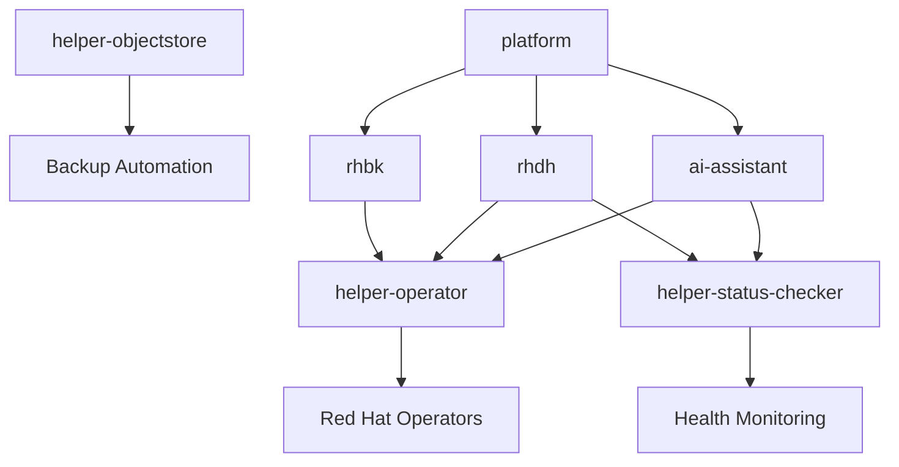

# Helm Charts Repository

[](LICENSE)
[](https://helm.sh)

## Overview

Enterprise Helm charts repository featuring operational helpers and AI-powered applications for Red Hat environments.

**Repository URL**: `https://jeanlopezxyz.github.io/helm-charts`
**Artifact Hub**: [jeanlopezxyz charts](https://artifacthub.io/packages/search?repo=jeanlopezxyz)

## Quick Start

```bash
# Add the Helm repository
helm repo add jeanlopezxyz https://jeanlopezxyz.github.io/helm-charts

# Update repository index
helm repo update

# List available charts
helm search repo jeanlopezxyz

# Browse charts online
open https://jeanlopezxyz.github.io/helm-charts
```

## Direct Downloads

Individual chart packages are available for download:

- **setup-rh-pipelines**: [setup-rh-pipelines-1.0.0.tgz](https://jeanlopezxyz.github.io/helm-charts/setup-rh-pipelines-1.0.0.tgz)
- **setup-rh-console**: [setup-rh-console-1.0.0.tgz](https://jeanlopezxyz.github.io/helm-charts/setup-rh-console-1.0.0.tgz)
- **setup-app-openshift-ai-asistant**: [setup-app-openshift-ai-asistant-2.0.0.tgz](https://jeanlopezxyz.github.io/helm-charts/setup-app-openshift-ai-asistant-2.0.0.tgz)

## Available Charts

### Helper Charts

| Chart | Version | Description |
|-------|---------|-------------|
| [helper-operator](charts/helper-operator/) | 1.0.28 | Meta-chart for installing operators |
| [helper-status-checker](charts/helper-status-checker/) | 4.0.13 | Health validation for deployments |
| [helper-objectstore](charts/helper-objectstore/) | 1.0.0 | Backup utilities and storage |
| [etcd-backup](charts/etcd-backup/) | 1.0.0 | Automated etcd backup |
| [etcd-defrag](charts/etcd-defrag/) | 0.1.0 | etcd maintenance automation |
| [gitea-setup](charts/gitea-setup/) | 1.0.0 | Git server deployment |

### Setup Charts

| Chart | Version | Description |
|-------|---------|-------------|
| [setup-app-openshift-ai-asistant](charts/setup-app-openshift-ai-asistant/) | 2.0.0 | OpenShift AI Assistant with RAG integration |
| [setup-rh-developer-hub](charts/setup-rh-developer-hub/) | 1.0.0 | Red Hat Developer Hub (Backstage) |
| [setup-platform-bookstack](charts/setup-platform-bookstack/) | 1.0.0 | Bookstack documentation platform |
| [setup-platform-gitea](charts/setup-platform-gitea/) | 1.1.0 | Gitea Git server with CI/CD |
| [setup-rh-keycloak](charts/setup-rh-keycloak/) | 1.0.0 | Red Hat Build of Keycloak operator |
| [setup-rh-pipelines](charts/setup-rh-pipelines/) | 1.0.0 | Red Hat Pipelines (Tekton) for CI/CD |
| [setup-rh-console](charts/setup-rh-console/) | 1.0.0 | Enhanced OpenShift Console operator |

## Usage Examples

### Installing Helper Charts

```bash
# Install operator helper (installs multiple operators)
helm install platform-operators jeanlopezxyz/helper-operator \
  --set operators.rhbk-operator.enabled=true \
  --set operators.openshift-ai-operator.enabled=true

# Install status checker (monitors health)
helm install health-monitor jeanlopezxyz/helper-status-checker \
  --set statusChecks.checks.ai-assistant.enabled=true \
  --set statusChecks.checks.rhdh.enabled=true
```

### Installing Setup Charts

```bash
# Install OpenShift AI Assistant (uses helpers)
helm install ai-assistant jeanlopezxyz/setup-app-openshift-ai-asistant

# Install Red Hat Developer Hub
helm install developer-hub jeanlopezxyz/setup-rh-developer-hub

# Install Red Hat Keycloak
helm install keycloak jeanlopezxyz/setup-rh-keycloak

# Install Red Hat Pipelines
helm install pipelines jeanlopezxyz/setup-rh-pipelines

# Install Enhanced Console
helm install console jeanlopezxyz/setup-rh-console

# Install Platform Components
helm install documentation jeanlopezxyz/setup-platform-bookstack
helm install git-server jeanlopezxyz/setup-platform-gitea

```

## Architecture

### Helper-First Architecture



### Deployment Flow

1. **Helpers** - Install operational utilities
2. **Operators** - Install via helper-operator
3. **Applications** - Deploy using helpers for automation
4. **Platform** - Meta-chart orchestrating everything

## Enterprise Features

### Security

- Non-root containers
- Read-only filesystems
- RBAC and ServiceAccounts
- Network policies
- Security context constraints

### Monitoring

- Prometheus metrics
- Health checking via helper-status-checker
- Grafana dashboards
- Alert management

### Backup

- Automated backup via helper-objectstore
- etcd cluster backup
- Database backup automation
- Configuration backup

### Automation

- Operator installation via helper-operator
- Health validation via helper-status-checker
- GitOps integration
- CI/CD automation

## Development

### Local Testing

```bash
# Clone repository
git clone https://github.com/jeanlopezxyz/helm-charts.git
cd helm-charts

# Test chart
helm lint charts/ai-assistant/
helm template ai-assistant charts/ai-assistant/ --debug

# Test with helpers
helm dependency update charts/ai-assistant/
helm install test-ai-assistant charts/ai-assistant/ --dry-run
```

### Contributing

1. Fork the repository
2. Create feature branch
3. Make changes
4. Test thoroughly
5. Submit pull request

## Support

- **Documentation**: Each chart includes comprehensive README
- **Issues**: [GitHub Issues](https://github.com/jeanlopezxyz/helm-charts/issues)
- **Contact**: Jean Lopez (jealopez@redhat.com)

## License

MIT License - See [LICENSE](LICENSE) file for details.